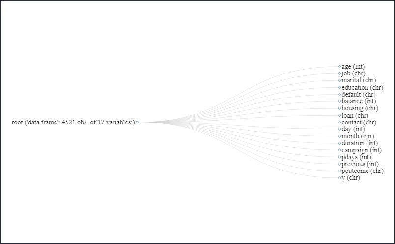

```{r setup, include=FALSE}
knitr::opts_chunk$set(echo = TRUE)
library(knitr)
library(tidyverse)
library(tidymodels)
library(vip)
library(rpart.plot)
library(DataExplorer)
library(tictoc)
library(data.table)
library(gtools)
```

## Memebers

Patrick Litte, patrick.little@ryerson.ca <br>
Manjola Chiappetta, m1chiappetta@ryerson.ca

## Summary

Our client for this project is a Portuguese bank that is looking for improvements to their telemarketing strategy.  This bank is marketing long-term deposit accounts such as bonds and savings account to a large variety of existing clients with a wide range of attributes. Our role in the project was to create a variety of predictive models which could be used to predict whether a client will subscribe to a term deposit or not, based on the bank’s past experience in marketing these products.  This predictive model would enable the client to target their marketing activities more efficiently to clients with a greater likelihood of subscribing to a term deposit.

<br>

In this project we compared two different predictive models, decision tree and Naïve Bayes and compared their accuracy as well as their Area under the Receiver Operator Curve.  For our extra credit, we compared these two more simple models against a more advanced Gradient Boosting model (XGBoost) to determine if a more advanced model could out preform the simpler models. 

<br>

In the best versions of our models we were able to achieve a model accuracy of 89.20% with a decision tree, 88.41% with Naive Bayes, and 91.33% with XGBoost.


### Tools

This project will leverage R for the exploratory data analysis, data preprocessing, predictive modeling, and model evaluation.  We will use the tidymodels framework to implement our predictive modelling, and model evaluation, and we will use the DataExplorer package to aid in exploratory data analysis.   


## Workload Distribution

| Member Name        | List of Tasks Preformed |
|--------------------|-------------------------|
| Patrick Little     | - some tasks            |
| Manjola Chiappetta | - some tasks            |

## Exploratory Data Analysis

In this section we will:
  - Look at the attribute types in the dataset
  - Find and missing values
  - Examine the pairwise association between our variables
  - Find max,min,mean and standard deviation of the atttributes
  - Determine any outlier values for the attributes under consideration
  - Analyze the distribution of numeric attributes

To begin our exploratory data analysis we can use the data explorer R package to generate an easy to consume overview of our dataset. In this plot one can observe that there are a mix of discrete and continuous variables in our dataset. Additionally we can observe that there is no missing data observations contained within our dataset. 

```{r echo=FALSE,warning=FALSE,results='markup'}
bank<-read.csv("https://raw.githubusercontent.com/PatLittle/CIND119-group-project/main/bank_marketing/bank.csv")
plot_intro(bank)
```
Looking at the individual columns of our dataset, one can observe their are 17 variables in our dataset. Age, balance, day, duration, campaign, duration, pdays, and previous are of type integer. Job, marital, education, default, housing, loan, contact, month, poutcome, and y are of type character. 

```{r echo=FALSE,warning=FALSE,results='markup'}

plot_str(bank, type="d", print_network = T, fontSize=25)

```


<br>
We can examine the values of our character variables to determine if character is the appropriate data type for each of the variables. If a variable of type character contains a limited number of possible values, then converting that variable to be of type factor will allow our predictive models to interpret that data without significant additional prepossessing. If those variables contain free form text without a controlled vocabulary for that variable, then likely additional natural language processing techniques such as stemming and lemmatizaion, along with other preprocessing or feature engineering may be required before those variables would offer significant predictive value to our models. 

```{r echo=FALSE,warning=FALSE,results='markup'}

job<-levels(as.factor(bank$job))
marital<-levels(as.factor(bank$marital))
education<-levels(as.factor(bank$education))
default<-levels(as.factor(bank$default))
housing<-levels(as.factor(bank$housing))
loan<-levels(as.factor(bank$loan))
contact<-levels(as.factor(bank$contact))
month<-levels(as.factor(bank$month))
poutcome<-levels(as.factor(bank$poutcome))
y<-levels(as.factor(bank$y))

na.pad <- function(x,len){
    x[1:len]
}

makePaddedDataFrame <- function(l,...){
    maxlen <- max(sapply(l,length))
    data.frame(lapply(l,na.pad,len=maxlen),...)
}

a = job
b = marital
c = education
d = default
e = loan
f = contact
g = month
h = poutcome
j = y

data_dict<-makePaddedDataFrame(list("Job"=a,"Marital"=b,"Education"=c,"Default"=d,"Loan"=e,"Contact"=f,"Month"=g,"pOutcome"=h,"y"=j))

data_dict %>% na.replace("")
options(knitr.kable.NA = '')
kable(data_dict, caption="Character Variables with all Existing Values")
```
Examining our table above of each of the variables of type character with the universe of existing values for each variables, serving as a simple data dictionary, we can determine that this is a controlled vocabulary and there is not unstructured text in these fields. Since there is a controlled vocabulary being used with these variables, we will convert these variables to be of type factor.

```{r echo=FALSE,warning=FALSE,results='markup'}
bank_clean<- bank %>% mutate_if(is.character, factor)
```

<br>

We can then examine the pairwise association between all of the variables in the dataframe. In this analysis we will use Spearman Correlation to measure the association between our numeric variables, Cramer's V for our nominal factor data, and ANOVA to compare numeric data with factor data. 


```{r echo=FALSE,warning=FALSE,results='markup'}


require(rcompanion)


# Calculate a pairwise association between all variables in a data-frame. In particular nominal vs nominal with Chi-square, numeric vs numeric with Spearman correlation, and nominal vs numeric with ANOVA.
# Adopted from https://stackoverflow.com/a/52557631/590437
mixed_assoc = function(df, cor_method="spearman", adjust_cramersv_bias=TRUE){
    df_comb = expand.grid(names(df), names(df),  stringsAsFactors = F) %>% set_names("X1", "X2")

    is_nominal = function(x) class(x) %in% c("factor", "character")
   
    is_numeric <- function(x) { is.integer(x) || is_double(x)}

    f = function(xName,yName) {
        x =  pull(df, xName)
        y =  pull(df, yName)

        result = if(is_nominal(x) && is_nominal(y)){
            
            cv = cramerV(as.character(x), as.character(y), bias.correct = adjust_cramersv_bias)
            data.frame(xName, yName, assoc=cv, type="cramersV")

        }else if(is_numeric(x) && is_numeric(y)){
            correlation = cor(x, y, method=cor_method, use="complete.obs")
            data.frame(xName, yName, assoc=correlation, type="correlation")

        }else if(is_numeric(x) && is_nominal(y)){
            
            r_squared = summary(lm(x ~ y))$r.squared
            data.frame(xName, yName, assoc=sqrt(r_squared), type="anova")

        }else if(is_nominal(x) && is_numeric(y)){
            r_squared = summary(lm(y ~x))$r.squared
            data.frame(xName, yName, assoc=sqrt(r_squared), type="anova")

        }else {
            warning(paste("unmatched column type combination: ", class(x), class(y)))
        }

       
        result %>% mutate(complete_obs_pairs=sum(!is.na(x) & !is.na(y)), complete_obs_ratio=complete_obs_pairs/length(x)) %>% rename(x=xName, y=yName)
    }

    # apply function to each variable combination
    map2_df(df_comb$X1, df_comb$X2, f)
}

cor_data<-mixed_assoc(bank_clean) %>% subset(assoc<0.99999) %>% arrange(desc(abs(assoc)))
kable(cor_data[1:16,1:4],row.names = F, caption = "Mixed Data Types Correlation/Association")
```
Looking at the top 8 pairs of variables in our pairwise comparison sorted by the absolute value of the association measure, we can see that the variables Previous and pDays seem to have a high measure of correlation. With a Spearman value of 0.986, we can state there is a highly monotonic relation between the variables. In this metric we are assessing if the variables move in the same direction, however this relation could be have one of a number of non-linear relation types such as exponential, logistic, etc.

Looking at the relations between our numeric variables with a different metric, one can use the Pearson correlation to assess the linearity of the relationships. With an R value of 0.58, the relation between the pDays and Previous variables is a moderate positive correlation. Since the R value is in a moderate range, there is still likely predictive value in including both variables in our models.

```{r echo=FALSE,warning=FALSE,results='markup'}
plot_correlation(bank_clean, type = "c", cor_args = list("method"="pearson"))
```
<br>
We can then look for outliers in our numeric variables. Comparing the median, mean, min, and max values for our numeric variables, we can observe that many of our numeric variables each have max or min values that vary by an order of magnitude between the IQR and the min/max value. This warrants furthur exploration into the outliers within the dataset. 

```{r echo=FALSE,warning=FALSE,results='markup'}

kable(summary(bank_clean))

```
<br>
We can also use this table to provide a baseline success number for our client's existing marketing effort. Based on the vaules of 'y' above, we can see that in 521 cases, customers subscribed to a term deposit product from the bank, and in 4000 cases they did not. This represents a conversion rate of ```r 521/4000`. One might deduce that a over 13% conversion rate on a marketing campaign is quite high, however using the analysis developed as part of this report, we feel we can increase our client's conversion rate.

<br>

Looking at a box plot of our numeric variables, we can get a sense for the extent of the distribution of outliers in each variable. 

```{r echo=FALSE,warning=FALSE,results='markup'}

plot_boxplot(bank_clean, by="y")

```

<br>

We can then remove outliers from the dataset, using the standard dentition of 1.5*IQR. 

```{r echo=FALSE,warning=FALSE,results='markup'}
age_out<-boxplot(bank_clean$age,plot=F)$out
bal_out<-boxplot(bank_clean$balance,plot=F)$out
campaign_out<-boxplot(bank_clean$campaign,plot=F)$out
duration_out<-boxplot(bank_clean$duration,plot=F)$out
pdays_out<-boxplot(bank_clean$pdays,plot=F)$out
prev_out<-boxplot(bank_clean$previous,plot=F)$out

bank_clean <- bank_clean[-which(bank_clean$age %in% age_out),]
bank_clean <- bank_clean[-which(bank_clean$balance %in% bal_out),]
bank_clean <- bank_clean[-which(bank_clean$campaign %in% campaign_out),]
bank_clean <- bank_clean[-which(bank_clean$duration %in% duration_out),]
bank_clean <- bank_clean[-which(bank_clean$pdays %in% pdays_out),]
bank_clean <- bank_clean[-which(bank_clean$previous %in% prev_out),]

head(bank_clean)


```
<br>
Using a standard outlier removal approach on all of our predictor variables results in zero rows left in our dataset for analysis. Therefore, for our modeling instead of manually removing outliers from the data, we will apply a YeoJohnson transform on our numeric variables. This should serve as a adequate method to both mitigate the effect of outliers, as well as contribute to normalizing the dataset.<br>

For our variable Day, although the data is encoded as a numeric variable, this represents more of a factor variables, therefore we will convert this variable to type factor such that it does not receive a YeoJohnson transform during our model preprocessing. 

```{r echo=FALSE,warning=FALSE,results='markup'}
bank_clean<- bank %>% mutate_if(is.character, factor)
bank_clean$day<-as.factor(bank_clean$day)
```


## Predictive Modeling / Classification

### Decision Tree

```{r echo=FALSE,warning=FALSE,results='markup'}

###Decision Tree


tic()


set.seed(888)
bank_split <- initial_split(bank_clean, prop = 0.75, 
                             strata = y)

bank_training <- bank_split %>% training()
bank_test <- bank_split %>% testing()
bank_folds <- vfold_cv(bank_training, v = 10)


bank_recipe <- recipe(y ~ ., data = bank_training) %>%
  step_YeoJohnson(all_numeric(),-all_predictors())
 


bank_clean_baked<-bank_recipe %>% 
  prep() %>% 
  bake(new_data = bank_training)

tree_model <- decision_tree(cost_complexity = tune(),
                            tree_depth = tune(),
                            min_n = tune()) %>% 
  set_engine('rpart') %>% 
  set_mode('classification')

tree_workflow <- workflow() %>% 
  add_model(tree_model) %>% 
  add_recipe(bank_recipe)

tree_grid <- grid_latin_hypercube(cost_complexity(),
                          tree_depth(),
                          min_n(), 
                          size = 60)

set.seed(888)


tree_tuning <- tree_workflow %>% 
  tune_grid(resamples = bank_folds,
            grid = tree_grid)


tree_tuning %>% show_best('roc_auc')

best_tree <- tree_tuning %>% 
  select_best(metric = 'roc_auc')


final_tree_workflow <- tree_workflow %>% 
  finalize_workflow(best_tree)


tree_wf_fit <- final_tree_workflow %>% 
  fit(data = bank_training)

tree_fit <- tree_wf_fit %>% 
  pull_workflow_fit()


rpart.plot(tree_fit$fit, roundint = F)

tree_last_fit <- final_tree_workflow %>% 
  last_fit(bank_split)

tree_last_fit %>% collect_metrics()


tree_last_fit %>% collect_predictions() %>% 
  roc_curve(truth  = y, estimate = .pred_no) %>% 
  autoplot()

tree_predictions <- tree_last_fit %>% collect_predictions()

conf_mat(tree_predictions, truth = y, estimate = .pred_class)

toc()

```
### Naive Bayes

```{r echo=FALSE,warning=FALSE,results='markup'}

tic()

set.seed(888)
nb_split <- initial_split(bank_clean, prop = 0.75, 
                            strata = y)

nb_training <- nb_split %>% training()
nb_test <- nb_split %>% testing()
nb_folds <- vfold_cv(nb_training, v = 10)

nb_recipe <- recipe(y ~ ., data = nb_training) %>%
  step_YeoJohnson(all_numeric(),-all_predictors())
  


nb_wf <- workflow() %>%
  add_recipe(nb_recipe)

library(discrim)
nb_spec <- naive_Bayes() %>%
  set_mode("classification") %>%
  set_engine("naivebayes")

nb_spec

nb_fit <- nb_wf %>%
  add_model(nb_spec) %>%
  fit(data = nb_training)

nb_wf_final <-  workflow() %>%
  add_recipe(nb_recipe) %>%
  add_model(nb_spec)

nb_rs <- fit_resamples(
  nb_wf_final,
  nb_folds,
  control = control_resamples(save_pred = TRUE)
)


nb_last_fit <- nb_wf_final %>% 
  last_fit(nb_split)

nb_last_fit %>% collect_metrics()

nb_last_fit %>% collect_predictions() %>% 
  roc_curve(truth  = y, estimate = .pred_no) %>% 
  autoplot()

nb_predictions <- nb_last_fit %>% collect_predictions()
conf_mat(nb_predictions, truth = y, estimate = .pred_class)

toc()

```
### XGBoost

```{r echo=FALSE,warning=FALSE,results='markup',cache=TRUE}
tic()

bank_clean<-as.data.table(bank_clean)

set.seed(888)
xg_split<- initial_split(bank_clean)
xg_train<-training(xg_split)
xg_test<-testing(xg_split)

set.seed(888)
xg_folds<-vfold_cv(xg_train,v=10)

xgb_spec <- boost_tree(
  trees = 2000, 
  tree_depth = tune(), min_n = tune(), 
  loss_reduction = tune(),                     
  sample_size = tune(), mtry = tune(),         
  learn_rate = tune()                        
) %>% 
  set_engine("xgboost") %>% 
  set_mode("classification")

xgb_spec

xgb_grid <- grid_latin_hypercube(
  tree_depth(),
  min_n(),
  loss_reduction(),
  sample_size = sample_prop(),
  finalize(mtry(), xg_train),
  learn_rate(),
  size = 60
)

xgb_grid

xgb_recipe <- recipe(y ~ ., data = xg_train) %>%
  step_dummy(all_nominal(), -all_outcomes())
  


xgb_recipe %>%
  prep() %>%
  bake(new_data = xg_train) 


xgb_wf <- workflow() %>%
  add_model(xgb_spec) %>%
  add_recipe(xgb_recipe)


library(doParallel)
cores<-detectCores()
cl<- makeCluster(cores[1]-4)
registerDoParallel(cl)


set.seed(888)
xgb_res <- tune_grid(
  xgb_wf,
  resamples = xg_folds,
  grid = xgb_grid,
  control = control_grid(save_pred = TRUE))

best_auc <- select_best(xgb_res, "roc_auc")


final_xgb <- finalize_workflow(
  xgb_wf,
  best_auc
)


final_res <- last_fit(final_xgb, xg_split)
collect_metrics(final_res)


final_res %>%
  collect_predictions() %>%
  roc_curve(y, .pred_no) %>%
  ggplot(aes(x = 1 - specificity, y = sensitivity)) +
  geom_line(size = 1.5, color = "midnightblue") +
  geom_abline(
    lty = 2, alpha = 0.5,
    color = "gray50",
    size = 1.2
  )


final_res %>%
  collect_predictions() %>% 
  conf_mat(truth = y, estimate = .pred_class)

library(vip)
final_xgb %>%
  fit(data = xg_train) %>%
  pull_workflow_fit() %>%
  vip(geom = "col")

toc()
```

<br>

### Initial Results
<br>
Examining the initial results of the models, we can see that we were able to achieve good results with all predictors being included in the model. With our tuned decision tree we were able to achieve a model accuracy of 87.61% and AUC of 81.61%. With our Naive Bayes model were were able to achieve an accuracy of 88.05% and AUC of 85.33%. We were able to out preform our first two models with our XGBoost model. This model achieved an accuracy of 91.15% and AUC of 91.10%. 

Since the source dataset for this project is relatively small, ~4500 observations of 17 variables, we are achieving performant model training times even with 10 fold cross validation and hyperparameter tuning. The end to end model training and evaluation for our decision tree is able to complete in about two minutes running as a single threaded workflow.

<br>
Our Naive Bayes model is even more performant completing the end to end model training and evaluation workflow in about 4 seconds. Since we are not tuning hyperparameters in this model, having a fast training time is expected.

<br>
The XGBoost model is a significantly more complicated model, and therefore takes considerable more training time. In a multithreaded workflow with 4 dedicated CPU cores, the model takes about 25 minutes to train when using 2000 trees, and tuning our other hyperparameters with a latin hyper cube of size 60. 
<br>

### Feature Selection

<br>
Using recursive feature selection can identify predictors that could be removed from the model, both to improve model training times, but also to potentially to reduce model overfitting. Based on a random forest algorithm, our recursive feature selection indicates that the best features to include in our model will be: Duration, Month, Day, pOutcome, pDay, age, Contact, and Previous. Additionally we will ensure we preserve our target variable 'y' in the dataset.

<br>
Using those feature, our recursive feature selectiion algorithm is indicating the model achieved an accuracy of 89.69%, training a random forest algorithm on the training data and evaluating the results on test data, with 10 fold cross validation. 

```{r echo=FALSE,warning=FALSE,results='markup',cache=TRUE}
tic()
library("caret")
control <- rfeControl(functions = rfFuncs, # random forest
                      method = "repeatedcv", # repeated cv
                      repeats = 5, # number of repeats
                      number = 10) # number of folds

# Features
x <- bank_clean %>%
  select(-y) %>%
  as.data.frame()

# Target variable
y <- bank_clean$y

# Training: 80%; Test: 20%
set.seed(888)
inTrain <- createDataPartition(y, p = .80, list = FALSE)[,1]

x_train <- x[ inTrain, ]
x_test  <- x[-inTrain, ]

y_train <- y[ inTrain]
y_test  <- y[-inTrain]

result_rfe1 <- rfe(x = x_train, 
                   y = y_train, 
                   sizes = c(1:16),
                   rfeControl = control)

# Print the results
result_rfe1

# Print the selected features
predictors(result_rfe1)

# Print the results visually
ggplot(data = result_rfe1, metric = "Accuracy") + theme_bw()

toc()
```


### Re-training on selected features

#### Decision Tree

```{r echo=FALSE,warning=FALSE,results='markup'}
###subsetting our selected features
bank_selected<-bank_clean[,c("duration","month","day","poutcome","pdays","age","contact","previous","y")]

###Decision Tree


tic()


set.seed(888)
bank_split <- initial_split(bank_selected, prop = 0.75, 
                             strata = y)

bank_training <- bank_split %>% training()
bank_test <- bank_split %>% testing()
bank_folds <- vfold_cv(bank_training, v = 10)


bank_recipe <- recipe(y ~ ., data = bank_training) %>%
  step_YeoJohnson(all_numeric(),-all_predictors())
 


bank_clean_baked<-bank_recipe %>% 
  prep() %>% 
  bake(new_data = bank_training)

tree_model <- decision_tree(cost_complexity = tune(),
                            tree_depth = tune(),
                            min_n = tune()) %>% 
  set_engine('rpart') %>% 
  set_mode('classification')

tree_workflow <- workflow() %>% 
  add_model(tree_model) %>% 
  add_recipe(bank_recipe)

tree_grid <- grid_latin_hypercube(cost_complexity(),
                          tree_depth(),
                          min_n(), 
                          size = 60)

set.seed(888)


tree_tuning <- tree_workflow %>% 
  tune_grid(resamples = bank_folds,
            grid = tree_grid)


tree_tuning %>% show_best('roc_auc')

best_tree <- tree_tuning %>% 
  select_best(metric = 'roc_auc')


final_tree_workflow <- tree_workflow %>% 
  finalize_workflow(best_tree)


tree_wf_fit <- final_tree_workflow %>% 
  fit(data = bank_training)

tree_fit <- tree_wf_fit %>% 
  pull_workflow_fit()


rpart.plot(tree_fit$fit, roundint = F)

tree_last_fit <- final_tree_workflow %>% 
  last_fit(bank_split)

tree_last_fit %>% collect_metrics()


tree_last_fit %>% collect_predictions() %>% 
  roc_curve(truth  = y, estimate = .pred_no) %>% 
  autoplot()

tree_predictions <- tree_last_fit %>% collect_predictions()

conf_mat(tree_predictions, truth = y, estimate = .pred_class)

toc()

```

#### Naive Bayes
```{r echo=FALSE,warning=FALSE,results='markup',cache=TRUE}

tic()

set.seed(888)
nb_split <- initial_split(bank_selected, prop = 0.75, 
                            strata = y)

nb_training <- nb_split %>% training()
nb_test <- nb_split %>% testing()
nb_folds <- vfold_cv(nb_training, v = 10)

nb_recipe <- recipe(y ~ ., data = nb_training) %>%
  step_YeoJohnson(all_numeric(),-all_predictors())
  


nb_wf <- workflow() %>%
  add_recipe(nb_recipe)

library(discrim)
nb_spec <- naive_Bayes() %>%
  set_mode("classification") %>%
  set_engine("naivebayes")


nb_fit <- nb_wf %>%
  add_model(nb_spec) %>%
  fit(data = nb_training)

nb_wf_final <-  workflow() %>%
  add_recipe(nb_recipe) %>%
  add_model(nb_spec)

nb_rs <- fit_resamples(
  nb_wf_final,
  nb_folds,
  control = control_resamples(save_pred = TRUE)
)


nb_last_fit <- nb_wf_final %>% 
  last_fit(nb_split)

nb_last_fit %>% collect_metrics()

nb_last_fit %>% collect_predictions() %>% 
  roc_curve(truth  = y, estimate = .pred_no) %>% 
  autoplot()

nb_predictions <- nb_last_fit %>% collect_predictions()
conf_mat(nb_predictions, truth = y, estimate = .pred_class)

toc()

```

#### XGBoost

```{r echo=FALSE,warning=FALSE,results='markup',cache=TRUE}
tic()

bank_selected<-as.data.table(bank_selected)

set.seed(888)
xg_split<- initial_split(bank_selected)
xg_train<-training(xg_split)
xg_test<-testing(xg_split)

set.seed(888)
xg_folds<-vfold_cv(xg_train,v=10)

xgb_spec <- boost_tree(
  trees = 2000, 
  tree_depth = tune(), min_n = tune(), 
  loss_reduction = tune(),                     
  sample_size = tune(), mtry = tune(),         
  learn_rate = tune()                        
) %>% 
  set_engine("xgboost") %>% 
  set_mode("classification")


xgb_grid <- grid_latin_hypercube(
  tree_depth(),
  min_n(),
  loss_reduction(),
  sample_size = sample_prop(),
  finalize(mtry(), xg_train),
  learn_rate(),
  size = 60
)


xgb_recipe <- recipe(y ~ ., data = xg_train) %>%
  step_dummy(all_nominal(), -all_outcomes())
  


xgb_recipe %>%
  prep() %>%
  bake(new_data = xg_train) 


xgb_wf <- workflow() %>%
  add_model(xgb_spec) %>%
  add_recipe(xgb_recipe)


library(doParallel)
cores<-detectCores()
cl<- makeCluster(cores[1]-4)
registerDoParallel(cl)


set.seed(888)
xgb_res <- tune_grid(
  xgb_wf,
  resamples = xg_folds,
  grid = xgb_grid,
  control = control_grid(save_pred = TRUE))

best_auc <- select_best(xgb_res, "roc_auc")


final_xgb <- finalize_workflow(
  xgb_wf,
  best_auc
)


final_res <- last_fit(final_xgb, xg_split)
collect_metrics(final_res)


final_res %>%
  collect_predictions() %>%
  roc_curve(y, .pred_no) %>%
  ggplot(aes(x = 1 - specificity, y = sensitivity)) +
  geom_line(size = 1.5, color = "midnightblue") +
  geom_abline(
    lty = 2, alpha = 0.5,
    color = "gray50",
    size = 1.2
  )


final_res %>%
  collect_predictions() %>% 
  conf_mat(truth = y, estimate = .pred_class)


toc()
```
Our model performance improved for both the Decision Tree and the Naive Bayes models. For the XGBoost model, limiting the number of predictors inputted into the model reduced performance. <br>

Our model accuracy for the decision tree model increased to 89.20% with the selected features, versus 87.61% for all features selected. For the Naive Bayes model, accuracy increased to 88.41% compared with our previous result of 88.05%. With XGBoost, model accuracy decreased to 90.71% versus 91.33% with all variables feeding the model. 

<br> 
Additionally, by limiting the number of predictor variables we were able to train the models faster. With our subset of predictors the Decision Tree model was able to complete the end to end training and evaulation workflow in about 75 seconds, verus about two minutes with the full dataset including all variables. The Naive Bayes model also experienced a proporitionally similar performance ain, completing the subset workflow in 3 seconds versus about 4 seconds with the full dataset. Our XGBoost model also had improved training times, saving about 5 minutes of training time with the smaller dataset from the 25 minutes it took to train on the full dataset.


## Conclusions and Recommendations

Based on our results we can conclude that feature selection can be an important activity to improve model performance with machine learning models such as Naive Bayes and Decision Trees. We were able to use several techniques to develop predictive models to predict if a customer would subscribe to one of client's term deposit products with an overall accuracy of approximately 90%. 

### Recomendations

It is recommended that our client implement a gradient boosting model such as the model developed as part of this report to pre-screen caller lists. If our client were able to restrict their outgoing calls to clients that our model predicts would be likely to subscribe to a term deposit product they would likely drastically improve their call conversion percentage, allowing them to get a much better ROI on their marketing spend. Additionally, reducing the volume of unwanted calls to clients not interested in term deposit products may improve their overall customer satisfaction.

## Appendix

### code

```{r ref.label = knitr::all_labels(), echo = TRUE, eval = FALSE}
# this R markdown chunk generates a code appendix
```
